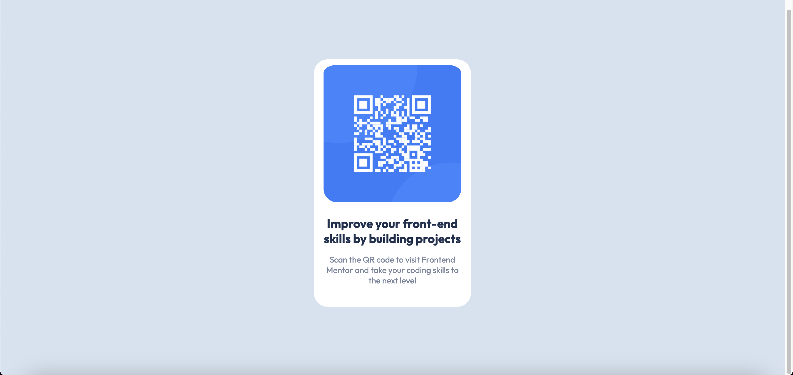

## Welcome! 👋

This is a solution to the QR code component challenge on Frontend Mentor. Frontend Mentor challenges help you improve your coding skills by building realistic projects.

## Table of contents

- [Overview](#overview)
  - [Screenshot](#screenshot)
  - [Links](#links)
- [My process](#my-process)
  - [Built with](#built-with)
- [Author](#author)

## Overview
A Frontend Mentor project to replicate a given design of a QR code graphic with only CSS and HTML.

### Screenshot

### Links

- Solution URL: [Solution]()
- Live Site URL: [Live Site](https://alopez-84.github.io/QR-Code-Challenge/)

## My process
This was just for practice as I continue to learn HTML and 

### Built with

- HTML
- CSS